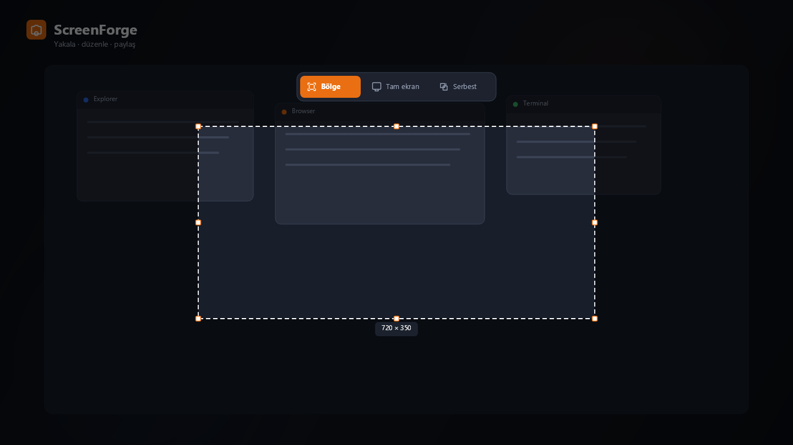
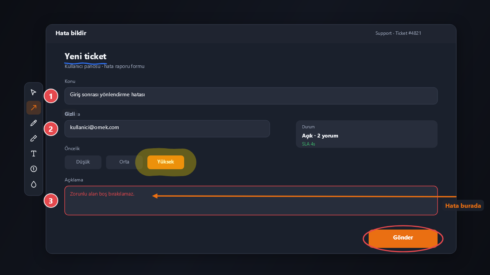

# ScreenForge — Windows Screenshot & Annotation Tool

**ScreenForge** is a modern, fast **screen capture and annotation** app for Windows. Lightshot-style workflow with drawing tools, numbered steps, blur/pixelate, freeform collage canvas, GIF and MP4 screen recording, and one-click cloud upload.

<p align="center">
  
</p>

<p align="center">
  <a href="https://github.com/ruwiss/screen_forge/releases/latest"></a>
  <a href="https://github.com/ruwiss/screen_forge/releases"></a>
  
  
  
  <a href="https://github.com/ruwiss/screen_forge/stargazers"></a>
</p>

<p align="center">
  <strong>Free Windows screenshot tool</strong> · Turkish UI · Windows 11–inspired dark theme<br/>
  Built with <strong>.NET 9 · WPF · SkiaSharp</strong>
</p>

---

## Why ScreenForge?

Looking for a **Lightshot alternative**, a better **Snipping Tool**, or a lightweight **screen recorder for short GIFs**? ScreenForge combines capture, annotation, export, and upload in one tray app:

- Capture a **region**, **fullscreen**, or a **freeform collage** canvas
- Annotate with arrows, shapes, pen, highlight, text, **numbered steps**, and **blur / pixelate**
- Export PNG, JPEG, or WebP — solid background or transparent
- Record a **region or fullscreen as GIF or MP4** and preview before save
- Upload to the cloud and get a shareable link
- Global hotkeys, system tray, settings, and auto-update

---

## Features

| Area | What you get |
|------|----------------|
| **Capture** | Region, fullscreen, freeform (collage) canvas |
| **Annotation** | Arrow, shapes, pen, highlight, text, steps, blur/pixelate |
| **Freeform mode** | Multi-select, copy / paste / duplicate, system clipboard PNG |
| **Output** | Copy, save (PNG/JPEG/WebP), cloud upload, GIF / MP4 |
| **Export** | Background or transparent + crop from the right edge |
| **System** | Tray icon, global hotkeys, settings, automatic updates |

---

## Screenshots

### Overview



Region selection and mode bar (Region · Fullscreen · Freeform).

### Annotation tools



Arrow, step numbers, highlight, text, ellipse, and blur over the selection.

---

## Global hotkeys

| Action | Default |
|--------|---------|
| Capture region | `Alt + Shift + S` |
| Fullscreen | unset |
| Fullscreen + upload | unset |
| Freeform / collage | unset |

Change shortcuts under **Settings → Hotkeys**.

---

## Download & install

### Binary (recommended)

Grab the latest build from **[GitHub Releases](https://github.com/ruwiss/screen_forge/releases/latest)**:

| File | Use |
|------|-----|
| `ScreenForge-win-Setup.exe` | Installer (auto-update ready) |
| `ScreenForge-win-Portable.zip` | Portable — no install |

Also mirrored under `Releases/` in this repo for packaging workflows.

### Requirements

- **Windows 10 / 11** (x64)
- No separate runtime install needed for release builds (self-contained packaging via Velopack)

### Build from source

Requires the [.NET 9 SDK](https://dotnet.microsoft.com/download).

```bash
dotnet build ScreenForge.sln -c Release
dotnet run --project ScreenForge/ScreenForge.csproj -c Release
```

```bash
dotnet test ScreenForge.Tests/ScreenForge.Tests.csproj -c Release
```

Optional README assets:

```bash
dotnet run --project tools/ReadmeAssets -c Release -- docs/readme
```

---

## Tech stack

| Layer | Choice |
|-------|--------|
| Runtime | .NET 9 |
| UI | WPF + Windows Forms interop |
| Drawing | SkiaSharp |
| Tray | H.NotifyIcon.Wpf |
| Updates | Velopack |
| MVVM helpers | CommunityToolkit.Mvvm |

---

## FAQ

### Is ScreenForge free?

Yes. ScreenForge is free to download and use for personal and internal work. See the [License](#license) section for redistribution.

### Is it a Lightshot / ShareX alternative?

It targets a **Lightshot-like** capture-and-annotate flow on Windows, with steps, blur, freeform collage, GIF region capture, and cloud upload. It is lighter than full ShareX-style tool suites and focused on daily screenshot workflows.

### Does it record video?

Yes. Region or fullscreen can be recorded as **MP4** (H.264, optional system audio and microphone) or as an **animated GIF**.

### What export formats are supported?

**PNG**, **JPEG**, and **WebP**, plus clipboard copy and optional cloud upload.

### Which languages are supported?

The UI is **Turkish**. The project and this README are documented in English for discoverability.

---

## Project layout

```
ScreenForge/          # Main WPF application
ScreenForge.Tests/    # Unit tests
docs/readme/          # README images
Releases/             # Packaged installers & portable zip
scripts/              # Packaging helpers (Velopack)
tools/ReadmeAssets/   # Optional screenshot asset generator
```

---

## Contributing

Issues and pull requests are welcome. For bugs, include Windows version, ScreenForge version, and steps to reproduce.

---

## License

Personal / internal use. For redistribution, contact the repository owner.

---

<p align="center">
  <sub>
    Keywords: Windows screenshot tool · screen capture · annotation · Lightshot alternative ·
    snipping tool · GIF recorder · blur · pixelate · WPF · SkiaSharp · .NET 9
  </sub>
</p>
